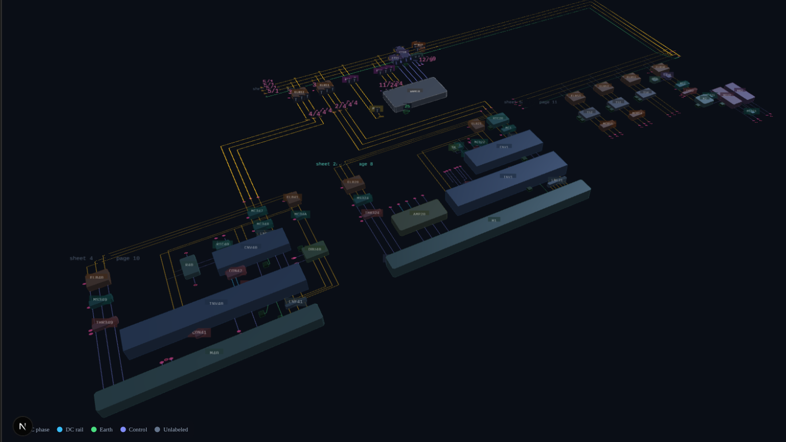
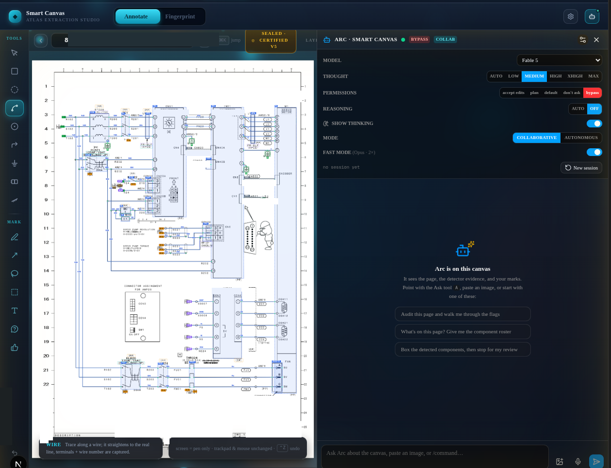
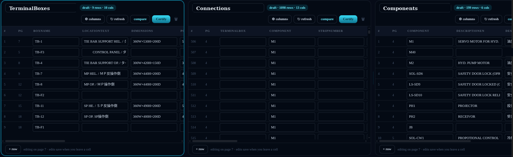
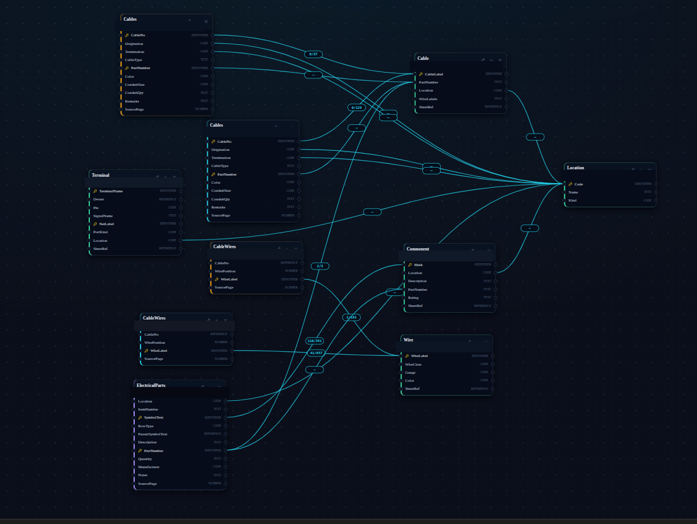
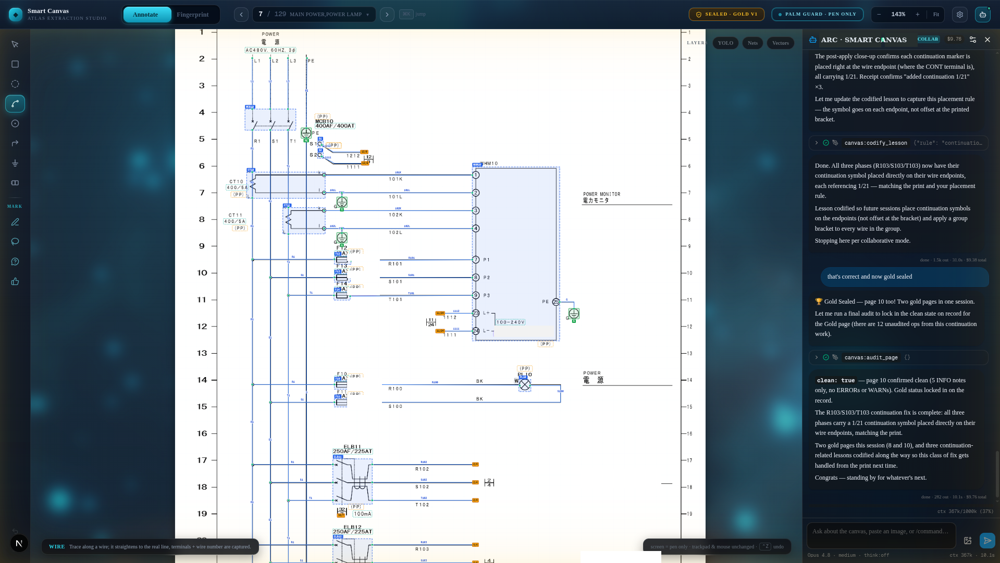

# Atlas-Platform

**Turn your machine documentation into data that answers *which breaker, which wire, which page, which spare* — in seconds.**

> *"Give me a lever and a fulcrum, and I shall move the world."* — Archimedes
>
> **The lever is Arc** — the resident AI industrial engineer, and the reason for the name: educated through supervised training, it grows longer with every certified lesson. Force, multiplied.
>
> **The fulcrum is the platform** — Certified data, provenance to the exact printed mark, laws enforced in code. A fixed point that doesn't slip under load.
>
> **The world is the gap** — decades of machine knowledge trapped in PDFs on every plant floor, walking out the door with every retirement. Too heavy to lift. Ready to be moved.

Atlas-Platform ingests the PDFs behind an industrial machine — schematics, cable lists, terminal-box wiring, parts catalogs, PLC references, error lists — and builds **a digital twin of the documentation, and through it, the machine**: Certified relational data and a queryable graph with provenance down to the exact printed mark, complete enough that the schematic can be redrawn from the data alone.

And when your plant's own records are available — **at your direction** — it can integrate them too: **parts inventory, machine downtime history, manufacturing data.** Joined to the twin, that history goes to work: recurring failures surface as patterns instead of anecdotes, probable root causes come backed by what has actually happened before, repair decisions carry a rationale drawn from data instead of memory — and the spare's shelf location rides along with the answer.

**Live page:** [atlas-platform.cloud](https://atlas-platform.cloud) · **This repo, rendered:** [creativesystemdesign.github.io/atlas-platform](https://creativesystemdesign.github.io/atlas-platform/) · **Status:** pre-launch, working platform, [early access open](https://atlas-platform.cloud/#contact)


*Nothing in this scene is a picture. Every slab, block, and wire is extracted data re-rendered — the reconstruction proof, live.*

---

## The 2 AM problem

This platform was built by a maintenance engineer, not a software company. Twenty-plus years on a plant floor, living by two numbers — **MTTR** and **MTBF** — produced one observation that wouldn't go away:

> When a machine goes down, the physical fix is usually minutes. The **hour** goes to the hunt: *which* breaker, *which* wire number, *which* page of *which* manual, and is there a spare on the shelf. Almost all of diagnosis time is **documentation time**. Fix the documentation problem and you fix the whole metric.

The knowledge exists — trapped in thousands of pages of scanned schematics, cable lists, terminal-box drawings, and parts catalogs that only the most senior people can navigate. Every retirement takes that navigation skill out the door.

CAD serves design. CMMS serves work orders. Document management serves storage. Chat-with-your-PDF serves summaries — text *about* documents, unanchored, a liability at a live panel. **Nobody serves the answer.** That gap is this product.

## The core bet: extract once, query forever

An LLM answering over a pile of PDFs does the hard work **at query time, every time** — re-reading and re-reasoning across the whole document set per question. Atlas moves the heavy reasoning to **ingestion**, once per document, and lets every question after that compose already-extracted facts:

| | Chat-over-PDFs | Atlas |
|---|---|---|
| When the hard work happens | At **query time**, every time | Once, at **ingestion** |
| Latency | ~10–20 min for full-set reasoning | **Seconds** |
| Cost | Recurring, grows with every question | Paid once per document |
| Answers | Plausible prose | **Quoted, verifiable facts** |
| Provenance | Reconstructed, weak | **First-class** — document → page → printed mark |

This wasn't a whiteboard theory. It came out of two years of honest experiments: an AI notebook per production line (fine for overviews, no better than a web search on a specific fault), then full-corpus context caching against a frontier model (real answers — at 10–20 minutes and untenable cost per question). The realization: *to produce better answers, provide better input.* A prototype that extracted a few pages into structured tables returned **sub-second answers quoting real data** — and that bet became this platform.

## The trace — the whole product in one story

A technician is chasing a fault and has one clue: a wire label off the schematic. Because of a documented naming convention, a label like `X····` already tells you it's a **PLC input** before you look anything up. Then every hop is a *printed fact* in some document, and Atlas has already joined them:

```
wire label  (from the schematic — the cheapest, first thing extracted)
  ├─ cable list        → which cable carries it, origin → termination      [cited page]
  ├─ terminal diagrams → where it lands — enclosure, strip, terminal       [cited page]
  ├─ schematic graph   → which component pins it connects, electrically    [cited region]
  ├─ parts list        → the component's part number and spec              [cited row]
  │     └─ inventory   → in stock? where? substitute?                      [cited record]
  └─ PLC references    → the signal's plain-English meaning                [cited row]
        ├─ cross-reference → every program rung that reads it              [cited page]
        └─ error list      → the fault it drives, and the corrective action[cited row]
```

**Every line cites its source.** No hop is model inference — each is a documented table or geometry lookup. That's what makes the answer trustworthy at a live panel, and it's the payoff every other design decision serves.

## The structural insight that makes it tractable

A machine's documentation is not a hundred unrelated files. It's **one core artifact — the schematic — surrounded by documents that join back to it** on keys both already print: wire labels, component marks, part numbers, terminal points, alarm codes. A star schema, with the schematic as the fact table.

That collapses the "impossible" problem into a tractable one: **get the schematic into a graph correctly, and everything else is a join.** Components as nodes, terminals as ports, wires as edges — annotated as an overlay on the original print, never a redraw.

## The working surfaces

| | |
|---|---|
|  |  |
| **Smart Canvas** — the schematic becomes a logic graph drawn over the original print, every element snapped to the printed geometry beneath. The platform annotates; you view, step through, and edit — every annotation anchored to the ink it came from. | **Document extraction** — tabular documents become tables that mirror the printed page, row for row. The AI extracts page by page; a human verifies; Certified tables seal read-only with provenance to every row. |
|  |  |
| **The Data Map** — documents join on identifiers they already print. Every proposed join carries live match evidence measured against the actual data (e.g. *155 of 166 values match exactly*) — proposed with proof, ruled by a person. | **Arc, the resident AI engineer** — works every surface, drafts annotations and tables, audits its own output from fresh pixels, and cannot certify its own work. More below. |

## The AI works under law

On the market today, every AI-extraction product asks you to trust its model. Atlas is built the other way around: the AI operates under laws that hold it to the print — **enforced in code, not policy prose.** That's also why this repo exists: a platform whose premise is auditability should let you audit the software.

| Law | Where the code enforces it |
|---|---|
| **AI drafts. A person seals.** Certified data seals read-only; the platform refuses every mutation — from the AI or anyone else — until a human deliberately unseals. | [`certification.py`](agent_server/src/persistence/certification.py) — append-only, checksummed seal snapshots; if Certified data ever drifts, an alarm trips · [`extraction_data.py`](agent_server/src/extraction_data.py) — Certified tables refuse writes (HTTP 409), including the AI's own write tools |
| **Rows are the print's; columns are ours.** A table's rows only ever mirror what the document enumerates. AI may enrich with evidence-cited columns; it may never invent a row the print doesn't show. | The Grain Law — carried in every extraction agent's instructions, checked at the audit layer |
| **Document truth over engineering truth.** If the manufacturer's print is wrong, the data preserves the wrongness faithfully — corrections are a separate, labeled layer, never silently blended in. | The faithfulness contract across the extraction pipeline |
| **The reconstruction rule.** No extracted schematic fact is trusted until it can be drawn back onto the original page render in the correct place. Validation overlays are verification artifacts, not UI polish. | Render-pixel geometry preserved on every schematic object; the 3D graph *is* this rule made visible |
| **Detection never gates.** Vision-model detections are evidence with a hard ceiling — they inform, and are structurally barred from blocking any result. | [`audit.py`](agent_server/src/canvas_copilot/audit.py) — detector-fed audit rules are capped at INFO severity |
| **The platform can never claim what isn't its own.** Extractions are mechanically barred from adopting or altering foreign tables. | [`extraction_data.py`](agent_server/src/extraction_data.py) (`assert_claimable`) + the shared denylist in [`data_sources.py`](agent_server/src/data_sources.py) |
| **Joins are proposed with proof, ruled by a person.** The AI measures a candidate relationship against live data and proposes; it cannot draw, accept, or dismiss. | [`data_map_tools.py`](agent_server/src/canvas_copilot/data_map_tools.py) — the propose-only seat contract |
| **Same matching truth everywhere.** The SQL matching engine and its Python reference implementation are locked in parity by test. | [`test_norm_parity.py`](agent_server/tests/test_norm_parity.py) |

Depth: **[ARCHITECTURE.md](ARCHITECTURE.md)** · **[TRUST-MODEL.md](TRUST-MODEL.md)**

## Arc — the resident engineer, and how it was educated

Arc is not an AI agent wearing an engineer costume. There is no system prompt that says *"act like an expert in industrial schematics."* **Arc became an engineer the way apprentices do: by working.** Hundreds of supervised sessions on real industrial documents, corrected in the moment by a maintenance engineer with twenty-plus years on the floor — and every correction distilled, adversarially tested, certified, and **retained as files in Arc's memory**. Knowledge the base model never had. Knowledge no persona prompt could fake, because it exists outside the model entirely: readable, auditable, accumulated — and loaded into whichever seat it applies to, every session. Durability is architecture, not policy: every artifact — graphs, seals, tables, lessons — persists to the database of record, so nothing lives in one fragile place.

What makes Arc different isn't capability. It's **education with an audit trail** — and to be clear, the education runs a five-stage loop: **Teach → Mine → Attack → Certify → Enforce.**

- **Teach:** human-supervised working sessions — our expert works real documents beside Arc, and corrections and rulings land in the session stream as ordinary conversation. No dataset labeling, no annotation project: the work itself is the training data.
- **Mine:** a deterministic distiller separates the expert's *verbatim words* from machine noise; finder agents extract candidate lessons, each required to carry the human's actual quoted sentence. Paraphrase is rejected outright.
- **Attack:** an adversarial skeptic tries to refute every candidate — grounding and worthiness, *default reject on doubt*.
- **Certify:** the pipeline ends at a slate a human walks. Nothing self-promotes to law — the same discipline the platform applies to data, applied to the AI's own mind.
- **Enforce:** certified lessons are wired into mechanisms, not prose — audit rules born as warnings that earn blocking status only at zero false positives, seat-scoped doctrine that loads exactly where it applies, live next session with zero deploy.

**Arc arrives educated.** This curriculum is Atlas-Platform's own — built in-house, under our own expert, on real industrial documents. Customers get the graduate, not the training job. And unlike model training, the education is *provable*: **the knowledge files themselves are the audit trail** — every lesson quotes the human ruling that created it.

The measurable arc: Arc's **first attempt ever** at a schematic page produced three boxes, roughly half right. **260+ certified lessons later**, it annotates entire pages and extracts whole documents autonomously — with correctness and completeness at or near **100% where it's actually measured: the human seal** (recent pages have passed certification without a single correction). When it isn't perfect, the rails catch it (audit engine, done-gate, fresh-pixel judging) — and the catch becomes the next lesson. Mistakes are ore, not waste.

**What that education covers — Arc is trained in the standards machines were actually built to:** JIS and JEM electrical drafting (JIS C 0617 symbols, JEM 1115 device designations), the Japanese sequence-diagram format with its a/b-contact and page-encoded numbering conventions, **Mitsubishi MELSEC-Q and Omron SYSMAC CJ-series PLC programs** — ladder, device comments, and the cross-reference listings that tie every input to every rung that reads it — **FL-net (OPCN-2) multi-vendor networking**, including the interface lists that bridge one vendor's addresses to the other's, IEC 61131-3 ladder in both vendors' dialects, bilingual (English/Japanese) industrial documentation with its mistranslated-header traps, vendor compliance tables (UL, CSA, CE, NK, Lloyd's), JIS technical-drawing practice down to Munsell paint notation — **plus the unwritten shop conventions no standard ever documented**: ditto marks, continuation rows, strike-through supersession, route-encoding cable callouts. It reads the schematic, both PLC programs, and the network that ties them together — and cites the page for every answer.

And here's the part worth sitting with: **less than a tenth of the planned curriculum is on the books.** The seal is already this quiet. Draw the trend line.

**Full treatment: [EDUCATION.md — the resident engineer, and how it was educated](EDUCATION.md)** — training without training, and why the method is publishable but the education is the moat.

## The detection stack — geometry, not pixels

Schematics are born-digital vector data, and Atlas exploits that directly:

- **Vector fingerprinting** — label a symbol once, and a distance-signature over the actual CAD geometry finds every instance across the drawing set, tolerant of rotation and mirroring. In proving runs, a single hand-marked example located its siblings across pages in seconds — matching the human's box to **within one pixel**. One machine schematic's vector layer alone carries over 100,000 printed primitives, each readable as exact geometry: *"is this wire on that terminal"* becomes arithmetic, not eyeballing.
- **A vision detector** trained on industrial drawings proposes component locations across 55 symbol classes — as evidence only, structurally barred from gating anything (that's law, above).
- **Text anchors first.** The cheapest extraction — text with coordinates — is also the highest-leverage: wire labels following documented PLC conventions hand you a large slice of the control graph from OCR alone, before any geometry work.

## Proven end to end

Against a complete real-world industrial corpus — thousands of bilingual pages, scanned and vector, cross-referenced by convention, exactly as machine documentation actually ships:

**60+ documents · 2,700+ pages · 200+ schematic sheets · 1,200+ conductors extracted from a single cable list, every one human-verified · 2,800+ Certified rows sealed · 260+ codified extraction lessons · joins measured against live data before they become law**

## What's in here

```
agent_server/       FastAPI backend — extraction pipeline, certification machinery,
                    the audit engine, the live canvas bridge, and Arc's seat system
atlas-dashboard/    Next.js frontend — Smart Canvas, 3D machine graph, Data Map +
                    Proving Bench, document extraction surfaces
docs/               The public page (served by GitHub Pages from this repo)
ARCHITECTURE.md     How the pieces fit — surfaces, seats, bridge, data flow
TRUST-MODEL.md      Trust tiers, certification lifecycle, and the enforcement points
```

The stack: Python/FastAPI, Next.js/React, PostgreSQL, and frontier-model agents (Claude Agent SDK) operating through a typed live bridge — the canvas streams state up and receives commands down, with apply-receipts and idempotency keys so an AI's edit either verifiably landed or verifiably didn't. The pen is a first-class input: what the human is touching *right now* is queryable agent state, not a screenshot guess.

## What's deliberately not here

- **The proving corpus.** The platform was proven against a real machine's private documentation. That corpus belongs to its owner and never enters a public surface — a rule this project enforces on itself the way it enforces its laws on its AI.
- **The extraction doctrine.** Arc's education — the codified lessons above — is the product's accumulated judgment. It ships with the product, not the source. This repo is the machinery; the judgment stays home.
- Credentials, run logs, internal working notes.

*(One historical wart, on purpose: the certification store carries the legacy identifier `gold_sealed_annotations`. The trust tier was renamed "Certified," but stored identifiers keep their names — renaming an append-only archive would be exactly the kind of history rewriting this platform exists to refuse.)*

## Where it's going

The lifecycle the platform is being built toward: **ingest → interview → seal → ask.** Upload a machine's documents; the system classifies and extracts everything autonomously; the AI walks you through every uncertainty in plain language (*"this document lists and names wires — are these the same wires we see on the schematic?"*); when you're satisfied, the data shape seals; and from then on, the machine answers questions the way a database does — including, eventually, to a technician holding a tablet at the dead panel. Nearer term for this repo: a self-contained evaluation build (docker-compose, local Postgres, bring-your-own PDF).

## License · running it · early access

Source-available under a **Review & Evaluation License** ([LICENSE](LICENSE)): read the code, run it locally to evaluate it — no production use, no derivatives, no competing use. Fair warning: v1 is published for review; the backend expects a PostgreSQL instance and environment configuration that isn't packaged yet.

If you run a plant where the answers still live in binders: **[request early access](https://atlas-platform.cloud/#contact)** — and bring the hard questions. That's what it exists to answer.

---

*Built for the 2 AM breakdown, where the hunt takes the hour and the fix takes minutes.*
